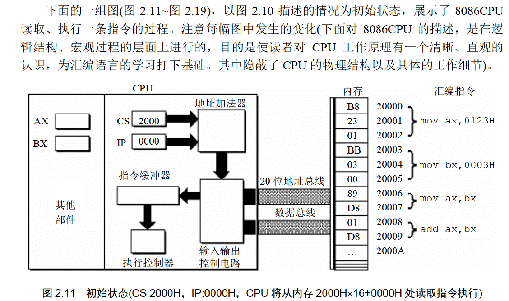

# 汇编语言

> 王爽 汇编语言第四版

# 第1章 基础知识

汇编是直接在硬件之上的编程语言. 本笔记教材是王爽的 汇编语言.

这一章主要回顾的是组成原理.

## 机器语言

汇编的诞生不得不提机器语言. 机器语言就是机器指令的集合即指令集. 机器指令请看组成原理. 

涉及到的CPU也移步组成原理.

不同处理器, 硬件设计跟内部结构不同, 就要用不同的电平脉冲来控制.故每种处理器都有自己的指令集, 就是机器语言.

## 汇编语言诞生

汇编的主体部分就是**汇编指令**.

汇编指令跟机器指令的区别, 就在指令的表示方法上. 汇编指令是机器指令便于记忆的书写格式(助记符).

汇编指令是机器指令的助记符.

例如:

```text
机器指令: 1000100111011000
操作: 寄存器BX的内容送到AX中
汇编指令: MOV AX,BX
这样的写法与人类语言接近,便于阅读和记忆.
```

> 提到了`寄存器`: 简单的讲是CPU中可以存储数据的器件, 一个CPU中有多个寄存器.
> AX是其中一个寄存器的代号, BX是另一个寄存器的代号.

计算机能读懂的只有`机器指令`, 那么如何让计算机执行程序员用汇编指令编写的程序呢？


> 写完汇编程序, 再用`编译器`翻译成机器认识的机器指令就行了.

## 汇编语言的组成

编语言由以下3类组成：

1. 汇编指令(机器码的助记符, 有对应机器码)
2. 伪指令   (由编译器执行, 无对应机器码所以计算机不执行)
3. 其它符号 (如加减乘除符号, 由编译器识别, 无对应机器码)

汇编语言的核心是**汇编指令**, 它决定汇编语言的特性.

## 存储器

CPU是计算机的核心部件, 它控制整个计算机的运作并进行运算, 要想让一个CPU 工作, 就必须向它提供指令和数据. 

指令和数据在存储器中存放, 也就是平时所说的内存. 内存的作用仅次于CPU.

磁盘与内存的区别, 看组成原理. 存储器这一块属于组成原理.

## 指令与数据

继续是组成原理的内容.

按照冯诺依曼结构, 指令和数据都存放在存储器中, 在内存中指令与数据是一样的二进制, 但放的位置不同.

> 二进制信息:1000100111011000  计算机可以视为89D8H(数据) 也可以视为MOV AX,BX (程序)

## 存储单元

去看组成原理. 

存储器被分为若干单元, 每个单元能存储若干二进制的信息.

## CPU对存储器的读写

CPU要进行数据的读写, 必须和外部器件(芯片), 进行三类信息交互:

1. 存储单元的地址信息.
2. 器件的选择, 读或写的命令, 控制信息.
3. 要读或写的数据, 数据信息.

CPU通过 地址总线, 控制总线, 数据总线传输信息. 具体看组成原理.


读过程:

1. CPU通过地址总线把地址信息3发送到MAR中.
2. CPU通过控制总线把1→R 发送到内存, 片选信号选中存储器芯片, 控制它取出数据到MDR
3. 内存把MDR的数据通过数据总线送到CPU内的寄存器中.

写过程类似.

从上面我们知道CPU是如何进行数据读写的. 可是我们如何命令计算机进行数据的读写呢？

对于8086CPU, 下面的机器码能够完成从3号单元读数据:
机器码: 101000010000001100000000
含义: 从3号单元读取数据送入寄存器AX
CPU接收这条机器码后将完成上面所述的读写工作.

这么长的程序谁记得住, 写成汇编:
机器码: 10100001 00000011 00000000
对应汇编: MOV AX,[3]
含义: 从3号单元读取数据送入寄存器AX

## 系统总线

看组成原理的BUS总线部分, 数据总线, 地址总线, 控制总线.

一个CPU有N条地址线, 就有CPU地址总线的宽度为N. CPU最多可以寻找2的N次方个内存单元.

数据总线的宽度决定CPU与外界的数据传送速度.

CPU对外控制是通过控制总线来进行的. 在这里控制总线是个总称, 是一些不同控制线的集合.

有多少根控制总线, 就意味着CPU提供了对外部器件的多少种控制.

控制总线的宽度决定了CPU对外部器件的控制能力.

## 主板

主板上有核心器件和一些主要器件, 他们通过总线相连. 

## 接口卡

CPU对外部设备都不能直接控制, 如显示器, 音响, 打印机等. 直接控制这些设备进行工作的是插在扩展插槽上的接口卡. 扩展插槽通过总线和CPU相连, 所以接口卡也通过总线与CPU相连. CPU可以直接控制这些接口卡, 从而实现CPU对外设的间接控制.

> CPU通过总线向接口卡发送命令, 接口卡根据CPU的命令控制外设工作.

## 各类存储器芯片

RAM ROM

从功能和连接上分类：

- 随机存储器RAM
- 装有BIOS的ROM
- 接口卡上的RAM(如显存)


## 内存地址空间

上述的那些存储器在物理上是独立的器件. 
但是它们在以下两点上相同：
 1、都和CPU的总线相连.
 2、CPU对它们进行读或写的时候都通过控制线发出内存读写命令.

CPU把它们都当做内存来看, 将它们总的看作一个由若干存储单元组成的逻辑存储器.

这个逻辑存储器就是我们所说的内存地址空间. 也是汇编在面对的内存地址空间.


上图所有的物理存储器被看作一个整体的逻辑存储器, 每个物理存储器在此逻辑存储器中占一个地址段, 即一段地址空间. CPU在这段地址段中读写数据, 实际上就是在想对应的物理存储器中读写数据.

假设，上图中的内存空间地址段分配如下：

地址0~7FFFH的32KB空间为主随机存储器的地址空间；
地址8000H~9FFFH的8KB空间为显存地址空间；
地址A000H~FFFFH的24KB空间为各个ROM的地址空间.

**不同的计算机系统的内存地址空间分配情况是不同的.**


内存地址空间:
最终运行程序的是CPU, 我们用汇编编程的时候, 必须要从CPU角度考虑问题.
对CPU来讲，系统中的所有存储器中的存储单元都处于一个统一的逻辑存储器中, 它的容量受CPU寻址能力的限制. 这个逻辑存储器即是我们所说的内存地址空间.

# 第2章 寄存器

CPU = 运算器 + 控制器 + 寄存器. 这些器件靠CPU内部总线相连.

内部总线实现CPU内部各个器件之间的联系.

外部总线实现CPU和主板上其它器件的联系.

CPU内部: 

- 运算器进行数据处理
- 寄存器进行信息存储
- 控制器控制各器件进行工作
- 内部总线连接各种器件, 在他们之间进行数据的传送.

对一个汇编程序员来说, CPU中的主要部件是寄存器. 它是CPU中程序员可以用指令读写的器件. 程序员通过改变各种寄存器中的内容来实现对CPU的控制.

不同CPU, 寄存器个数, 结构是不一样的. 8086CPU有14个寄存器: AX,BX, CX, DX SI DI SP BP IP CS SS DS ES PSW.

## 通用寄存器

8086CPU所有的寄存器都是**16位**的, 可以存放两个字节.
AX, BX, CX, DX 通常用来存放**一般性数据**被称为**通用寄存器.**


为了兼容上一代CPU的8位寄存器.

8086CPU的这几个通用寄存器把16位劈开成两个8位用.

AX 分成AH, AL. BX, CX, DX都一样.


> AX的低8位(0位\~7位)构成了AL寄存器, 高8位(8位\~15位)构成了AH寄存器.
> AH和AL寄存器是可以独立使用的8位寄存器.

## 字在寄存器中的存储

出于兼容性, 8086CPU可以一次处理以下两种尺寸的数据.

- 字节: byte, 8个bit.
- 字: word, 16个bit. 两个字节, 高字节, 低字节.


高字节跟低字节可以合起来看作一个整体, 也可以各自视为一个整体.

## 数制

不讨论了, 组成原理讲过太简单.

## 几条汇编指令


**汇编指令或者寄存器名`不区分大小写`**.

	

> 16位所以是044CH, 进位的那个1, 之后讨论.


> 这个结果是, 0058H, 因为这里AL作为一个整体只有8位, 不会去用AH的数据位.
>
> 但如果最后一条指令是 add ax,93H,  那ax里就是0158H了.因为用的是ax16位的.


> 上面都是`错误`的指令. 因为会溢出.

## 物理地址

CPU访问内存单元时要给出内存单元的地址. 所有的内存单元构成的存储空间是一个一维的线性空间.
每个内存单元在这个空间都有唯一的地址, 我们将这个唯一的地址称为**物理地址**.

CPU通过地址总线送入存储器的, 必须是一个内存单元的物理地址. 那在CPU发出物理地址之前, 必须要先在内部形成这个物理地址.

不同的CPU形成物理地址的方式可以不尽相同.  本学习是8086CPU.

## 16位结构的CPU

概括的讲, 16位结构描述了一个CPU具有以下几个方面特征:

1. 运算器一次最多可以处理16位的数据.
2. 寄存器的最大宽度为16位.
3. 寄存器和运算器之间的通路是16位的.

8086就是16位机, 8086一次性可以处理,传输, 暂存的信息最长 16位. 内存单元地址也必须在8086中处理,传输,暂存.

## 8086给出物理地址的方法

8086有20位地址总线, 可传送20位地址, 寻址能力为1M.

8086内部为16位结构, 它只能传送16位的地址, 表现出的寻址能力却只有64K.

8086CPU采用一种在内部**用两个16位地址合成的方法**来形成一个20位的物理地址.


如上图, 当8086要读写内存时:

1. CPU中的相关部件提供两个16位的地址, 一个称为**段地址**, 另一个称为**偏移地址;**
2. 段地址和偏移地址通过**内部总线**送入一个称为**地址加法器**的部件;
3. **地址加法器将两个16位地址合并成一个20位的物理地址;**
4. 地址加法器通过**内部总线**把20位物理地址送入**输入输出控制电路**;
5. 输入输出控制电路将20位物理地址送上**地址总线**.
6. 20位物理地址被地址总线传到**存储器**.

地址加法器合成物理地址的方法：
         **物理地址=段地址×16+偏移地址**


> “段地址×16”有一个更为常用的说法就是数据左移4位(二进制位).
>
> 

## "物理地址=段地址×16+偏移地址"的本质

本质含义: CPU在访问内存时, 用一个**基础地址**(`段地址x16`)和一个相对于基础地址的**偏移地址**相加, 给出内存单元的物理地址.

这种寻址功能就是 **基础地址+偏移地址 = 物理地址**.(具体看组成原理.)寻址模式的一种具体实现方案. 这里段地址左移4位可以看作一个基地址.

## 段的概念

内存没有被分段, **段的划分是来自CPU**, 由于8086CPU用"(段地址×16)+偏移地址=物理地址"的方式给出内存单元的物理地址, 使得我们可以**用分段的方式来管理内存.**


> 左边的基础地址是10000H, 段地址就是1000H.右边有两个段, 两个基础地址分别为10000H 和 10080H. 那么他们的段地址分别为 1000H和1008H.

以后, 在编程时可以**根据需要**, **将若干地址连续的内存单元看作一个段**, 用段地址x16定位段的起始地址(基础地址), 用偏移地址定位段中的内存单元.

注意点:

- 段地址x16比然是16的倍数, 所以一个段的起始地址也一定是16的倍数.

- 偏移地址为16位, 16位地址的**寻址能力**为64KB, 所以**一个段的长度最大64KB.**

## 内存单元地址小结

CPU访问内存单元时必须向内存提供内存单元的物理地址.

8086在内部用段地址和偏移地址移位相加形成最终的物理地址.

看:

| 物理地址 | 段地址 | 偏移地址 |
| :------: | :----: | :------: |
|  21F60H  | 2000H  |  1F60H   |
|          | 2100H  |  0F60H   |
|          | 21F0H  |  0060H   |
|          | 21F6H  |  0000H   |
|          | 1F00H  |  2F60H   |

> 结论: CPU可以用不同的段地址和偏移地址来形成同一个物理地址.
>
> 只需要满足段地址SA和偏移地址EA满足 SAx16+EA = 要访问的地址

另一个问题: 若给定一个段地址, 仅通过变化偏移地址来进行寻址, 最多可定位多少个内存单元.

结论: 偏移地址16位, 范围0\~FFFFH, 答案就是64K个内存单元.

如, 给定段地址1000H, 用偏移地址寻址, CPU的寻址范围位: 10000H\~1FFFFH.

在8086机中, 存储单元的地址用两个元素来描述, 段地址和偏移地址.

21F60H 这个地址 在8086中表述为 2000:1F60. 或者 2000H段中的1F60H单元

可以根据需要, 将**地址连续, 起始地址是16倍数**的**一组内存单元**定义为一个段.	

## 段寄存器

上面说到, 8086CPU在访问内存时要由相关部件提供内存单元的段地址和偏移地址, 送入地址加法器合成物理地址.

那是什么部件提供段地址的呢? 

**段地址存放在8086CPU的段寄存器中.**

8086CPU有**4个段寄存器:** `CS, DS, SS, ES`. CPU要访问内存时, 由此4个寄存器提供内存单元的段地址.

> CS: Code Segment; DS: Data Segment; SS: Stack Segment; ES: Extra Segment; 

## CS和IP

CS和IP是8086CPU中最关键的两个寄存器了. **它们指示了CPU当前读取指令的地址.**

CS是**代码段寄存器**, IP是**指令指针寄存器**.

在8086机器中, 任意时刻, 设CS中的内容为M, IP中的内容为N, 8086CPU将从**内存Mx16+N单元开始**, **读取一条指令并执行.** 

> Code Segment 代码段, 其实就是指令段.

换种表述: 8086机器中, 任意时刻, CPU将CS:IP指向的内容当做指令执行.	

下图展示了8086机读取,执行指令的工作过程.(图中数据皆为16进制)	


上图说明:

1. 8086CPU当前状态: CS中内容是2000H, IP是0000H

2. 内存20000H\~20009H 单元存放着可执行的机器码;

3. 机器码对应的汇编指令:

   地址: 20000H\~20002H, 内容: B8 23 01, 长度: 3Byte. 对应汇编: mov ax, 0123H.

   地址: 20003H\~20005H, 内容: BB 03 00, 长度: 3Byte. 对应汇编: mov bx, 0003H.

   地址: 20006H\~20007H, 内容: 89 D8, 长度: 2Byte. 对应汇编: mov ax, bx.

   地址: 20008H\~20009H, 内容: 01 D8, 长度: 2Byte. 对应汇编: add ax, bx.




上面这些过程, 简述如下:

1. 从CS:IP指向内存单元读取指令, 读取的指令进入指令缓冲器;
2. **IP = IP + `所读取指令的长度`**, **从而指向下一条指令**; 
3. 执行指令.  转到步骤 (1), 重复这个过程.

**在 8086CPU 加电启动或复位后**(即CPU刚开始工作时)CS和IP被设置为**CS=FFFFH, IP=0000H**, 即在8086PC机刚启动时, **CPU从内存FFFF0H单元中读取指令执行, `FFFF0H单元中的指令是8086PC机开机后执行的第一条指令`**.

之前说过, 在内存中, 指令与数据没有任何区别, 都是二进制信息, CPU在工作的时候把有的信息看作指令, 而有的看做数据. 那CPU根据上面将内存中的信息看作指令? 我们可以说, CPU将CS:IP指向的内存单元中的内容看作指令. 

因为 在任何时候, CPU将CS, IP中的内容当作指令的段地址和偏移地址, 用它们合成指令的物理地址, 到内存中读取指令码, 执行.

如果说, 内存中的一段信息曾被CPU执行过的话, 那么,它所在的内存单元必然被CS:IP指向过.

## 修改CS, IP的指令

在CPU中, 程序员能够用指令读写的部件, 只有寄存器, 可以通过改变寄存器中的内容实现对CPU的控制. CPU从何处

执行指令是由CS, IP中的内容决定的, 程序员可以通过改变CS, IP中的内容来控制CPU执行目标指令.

我们之前改通用寄存器的值是用mov 指令. 但mov不能用于设置CS, IP. 原因很简单, 8086CPU没提供这样的功能.

8086CPU中, 能改变CS, IP的内容的指令, 被统称为**转移指令.** 比如**jmp指令**.

若想**同时修改CS, IP的内容**, 可用"jmp 段地址:偏移地址"的指令完成. 如:

jmp 2AE3:3, 执行后: CS=2AE3H, IP=0003H,  CPU从2AE33H地址处取指令.

jmp 3:0B16, 执行后: CS=0003H, IP=0B16H, CPU从00B46H处读取指令.

**`"jmp 段地址:偏移地址" 指令的功能为: 用指令中给出的段地址修改CS, 偏移地址修改IP.`**

**只想修改IP的内容**, 可用**"jmp 某一合法寄存器"**的指令完成, 如:

jmp ax, 指令执行前, ax=1000H, CS=2000H, IP=0003H, 执行后:

ax=1000H, CS=2000H, **IP=1000H**.    只有IP的内容被ax中内容覆盖. 

jmp bx, 执行前, bx=0B16H, CS=2000H, IP=0003H. 

执行后, bx=0B16H, CS=2000H, **IP=0B16H.** 

**`"jmp 某一合法寄存器"指令功能为: 用该寄存器里的值修改IP.`**


他的执行流程:

1. mov ax,6622H
2. jmp 1000:3
3. mov ax,0000
4. mov bx, ax
5. jmp bx
6. mov ax,0123H
7. 转第三步.

## 代码段

对8086PC机, 编程时可以根据需要, 将一组内存单元定义为一个段. 可以将长度为 N(N≤64KB)的一组代码, 存在一组地址连续, 起始地址为16的倍数的内存单元中, 这段内存是用来存放代码的, 从而定义了一个**代码段**.

比如,将:

1. mov ax,0000
2. mov ax,0123H
3. mov bx, ax
4. jmp bx

这段长度为10字节的字节的指令, 存在从123B0H\~123B9H的一组内存单元中, 我们就可以认为, 123B0H\~123B9H**这段内存单元是用来存放代码的**, **是一个代码段**, 它的段地址为123BH, 长度为10字节.

如何使得代码段中的指令被执行呢？
将一段内存当作代码段, 仅仅是我们在编程时的一种安排, CPU 并不会由于这种安排, 就自动地将我们定义得代码段中的指令当作指令来执行.

**CPU只认被 CS:IP 指向的内存单元中的内容为指令**, 所以想要CPU执行我们放在代码段中的指令, 就**要将CS:IP指向所定义的代码段中的第一条指令的首地址.**
如刚才的CS = 123BH, IP = 0000H.

**2.9节~2.12节 小结**

1. 段地址在8086CPU的寄存器中存放. 当8086CPU要访问内存时, 由段寄存器提供内存单元的段地址. 8086CPU有4个段寄存器, 其中CS用来存放指令的段地址. 
2. CS存放指令的段地址, IP存放指令的偏移地址. 8086机中, 任意时刻, CPU将CS:IP指向的内容当作指令执行.
3. 8086CPU的工作过程：
   (1)从CS:IP指向内存单元读取指令, 读取的指令进入指令缓冲器;
   (2)IP指向下一条指令；
   (3)执行指令.(转到步骤(1), 重复这个过程.)
4. 8086CPU提供转移指令修改CS, IP的内容.


mov指令读取完, IP增加, SUB指令读取完, IP增加, JMP指令读取完, IP增加, JMP指令执行, IP被修改.

## 实验一

看书跟着做. win 10的debug百度搜.


# 第3章 寄存器(内存访问)

第2章主要是从CPU如何执行指令的角度了解8086CPU的逻辑结构, 形成物理地址的方法, 相关的寄存器以及一些指令.

## 内存中字的存储

CPU里的寄存器, 高八位存高字节, 低八位存低字节, 16位存一个字.

内存中呢, 内存单元是字节单元(一单元存一个字节0), 那一个字就用连续的两个内存单元放, 低字节放低地址中, 

高字节放高地址中.


上面就是存放4E20H, 跟0012H的内存分布. 0号单元是低地址单元, 1号单元是高地址单元.

> 字单元的概念: 字单元, 即存放一个字型数据(16位)的内存单元, 由两个地址连续的内存单元组成. 高地址内存单元存放高字节, 低地址内存单元存放低字节.

**将起始地址为N的`字单元`简称为N地址字单元.**

任何两个地址连续的内存单元, N号单元和N+1号单元, 可以将它们看成两个内存单元, 也可以看成一个地址为N的字单元中的高位字节单元和低位字节单元.

## DS和[address]

CPU要读取一个内存单元的时候, 必须先给出这个内存单元的地址;
在8086PC中, 内存地址由段地址和偏移地址组成.
8086CPU中有一个DS寄存器, 通常用来存放要访问的数据的段地址.

例如:我们要读取10000H单元的内容可以用如下程序段进行:
```    asm
mov bx,1000H
mov ds,bx
mov al,[0]
```
上面三条指令将`10000H(1000:0)`中的数据读到`al`中。

已知的mov指令可完成的两种传送功能：
（1）将数据直接送入寄存器;
（2）将一个寄存器中的内容送入另一个寄存器中.

**除此之外, mov 指令还可以将一个内存单元中的内容送入一个寄存器.**

mov指令的格式：
      **mov 寄存器名, 内存单元地址**

“[…]”表示一个内存单元,  “[…]”中的0表示**内存单元的偏移地址**.

**执行指令时, 8086CPU自动取`DS中的数据`为内存单元的`段地址`.**

如何用mov指令从10000H中读取数据？
10000H表示为1000:0(段地址:偏移地址)
将段地址1000H放入ds
用mov al,[0]完成传送. (mov指令中的[]说明操作对象是一个内存单元, []中的0说明这个内存单元的偏移地址是0, 它的段地址默认放在ds中) 指令执行时, 8086CPU自动从DS中取出.

```asm
mov bx,1000H
mov ds,bx
```
**如何把1000H送入ds？**

8086CPU不支持将数据直接送入段寄存器的操作, ds是一个段寄存器.(硬件设计的问题)

mov ds,1000H 是非法的. 只好用一个寄存器作为中转.

**数据→通用寄存器→DS段寄存器**

> 前面的CS寄存器是用jmp改的.

## 字的传送

上面mov指令在寄存器与内存之间进行**字节型**数据的传送.  8086CPU是16位结构, 有16根数据线, 所以可一次性传16位数据, 即一个字. **只需要在mov指令中给出16位寄存器名就行**.

```asm
mov bx,1000H
mov ds,bx
mov ax,[0]  ;1000:0字节型数据传到ax
mov [0],cx
```


> 上面的每一步执行结果依次是: ax=1000H, ds=1000H, ax=1123H,bx=6622H,cx=2211H,bx=6622H+2211H=8833H, cx=2211H+6622H=8833H

**如果目标寄存器是8位, 就取8位, 目标寄存器是16位就到内存取16位. 高地址高字节, 低地址低字节.**

问题3.4 看图3.3, 指令执行完内存中的值是多少.


> ax=1000H, ds=1000H, ax=2C34H, [0]=34H, [1]=2CH, bx=2C34H, bx=2C34-1122H=1B23H, 
>
> [2]=23H, [3]= 1BH.

## mov,add,sub指令

**已学mov指令的几种形式：**

​	mov 寄存器, 数据
​	mov 寄存器, 寄存器
​	mov 寄存器, 内存单元
​	mov 内存单元, 寄存器
​	mov 段寄存器,寄存器

**由此推到正确的命令:**

​	mov 寄存器,段寄存器
​	mov 内存单元,寄存器
​	mov 内存单元,段寄存器
​	mov 段寄存器,内存单元

> mov 内存单元, 数据 是错的
>
> 同时注意`CS`跟`IP`这两个特殊的寄存器.

**add与sub有以下几种:**

​	add/sub 寄存器,数据
​	add/sub 寄存器,寄存器
​	add/sub 寄存器,内存单元
​	add/sub 内存单元,寄存器

**错误的:**

​	add/sub 段寄存器,寄存器, 
​	add/sub 内存单元, 内存单元,
​	add/sub 内存单元, 数据

## 数据段Data Segment

前面讲过, 对于8086PC机, 我们可以根据需要将一组内存单元定义为一个段(可以是代码段, 数据段等). 

我们可以将一组长度为N(N≤64K), 地址连续, 起始地址为16的倍数的内存单元当作专门存储数据的内存空间, 从而定义了一个**数据段.** 

那数据段肯定离不开DS寄存器的使用了.

> 不管是现在的数据段, 还是之前的指令段. 寻址方式都是一样的, `段地址x16 + 偏移量`.
> 只不过CS寄存器的偏移量是IP中的内容罢了, 而DS的偏移量是具体的数字[n].