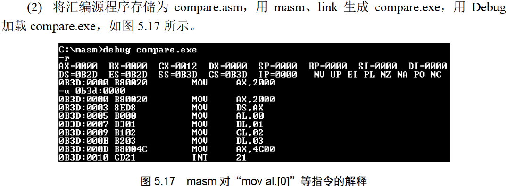

# 汇编语言

> 王爽 汇编语言第四版

# 第1章 基础知识

汇编是直接在硬件之上的编程语言. 本笔记教材是王爽的 汇编语言.

这一章主要回顾的是组成原理.

## 机器语言

汇编的诞生不得不提机器语言. 机器语言就是机器指令的集合即指令集. 机器指令请看组成原理. 

涉及到的CPU也移步组成原理.

不同处理器, 硬件设计跟内部结构不同, 就要用不同的电平脉冲来控制.故每种处理器都有自己的指令集, 就是机器语言.

## 汇编语言诞生

汇编的主体部分就是**汇编指令**.

汇编指令跟机器指令的区别, 就在指令的表示方法上. 汇编指令是机器指令便于记忆的书写格式(助记符).

汇编指令是机器指令的助记符.

例如:

```text
机器指令: 1000100111011000
操作: 寄存器BX的内容送到AX中
汇编指令: MOV AX,BX
这样的写法与人类语言接近,便于阅读和记忆.
```

> 提到了`寄存器`: 简单的讲是CPU中可以存储数据的器件, 一个CPU中有多个寄存器.
> AX是其中一个寄存器的代号, BX是另一个寄存器的代号.

计算机能读懂的只有`机器指令`, 那么如何让计算机执行程序员用汇编指令编写的程序呢？


> 写完汇编程序, 再用`编译器`翻译成机器认识的机器指令就行了.

## 汇编语言的组成

编语言由以下3类组成：

1. 汇编指令(机器码的助记符, 有对应机器码)
2. 伪指令   (由编译器执行, 无对应机器码所以计算机不执行)
3. 其它符号 (如加减乘除符号, 由编译器识别, 无对应机器码)

汇编语言的核心是**汇编指令**, 它决定汇编语言的特性.

## 存储器

CPU是计算机的核心部件, 它控制整个计算机的运作并进行运算, 要想让一个CPU 工作, 就必须向它提供指令和数据. 

指令和数据在存储器中存放, 也就是平时所说的内存. 内存的作用仅次于CPU.

磁盘与内存的区别, 看组成原理. 存储器这一块属于组成原理.

## 指令与数据

继续是组成原理的内容.

按照冯诺依曼结构, 指令和数据都存放在存储器中, 在内存中指令与数据是一样的二进制, 但放的位置不同.

> 二进制信息:1000100111011000  计算机可以视为89D8H(数据) 也可以视为MOV AX,BX (程序)

## 存储单元

去看组成原理. 

存储器被分为若干单元, 每个单元能存储若干二进制的信息.

## CPU对存储器的读写

CPU要进行数据的读写, 必须和外部器件(芯片), 进行三类信息交互:

1. 存储单元的地址信息.
2. 器件的选择, 读或写的命令, 控制信息.
3. 要读或写的数据, 数据信息.

CPU通过 地址总线, 控制总线, 数据总线传输信息. 具体看组成原理.


读过程:

1. CPU通过地址总线把地址信息3发送到MAR中.
2. CPU通过控制总线把1→R 发送到内存, 片选信号选中存储器芯片, 控制它取出数据到MDR
3. 内存把MDR的数据通过数据总线送到CPU内的寄存器中.

写过程类似.

从上面我们知道CPU是如何进行数据读写的. 可是我们如何命令计算机进行数据的读写呢？

对于8086CPU, 下面的机器码能够完成从3号单元读数据:
机器码: 101000010000001100000000
含义: 从3号单元读取数据送入寄存器AX
CPU接收这条机器码后将完成上面所述的读写工作.

这么长的程序谁记得住, 写成汇编:
机器码: 10100001 00000011 00000000
对应汇编: MOV AX,[3]
含义: 从3号单元读取数据送入寄存器AX

## 系统总线

看组成原理的BUS总线部分, 数据总线, 地址总线, 控制总线.

一个CPU有N条地址线, 就有CPU地址总线的宽度为N. CPU最多可以寻找2的N次方个内存单元.

数据总线的宽度决定CPU与外界的数据传送速度.

CPU对外控制是通过控制总线来进行的. 在这里控制总线是个总称, 是一些不同控制线的集合.

有多少根控制总线, 就意味着CPU提供了对外部器件的多少种控制.

控制总线的宽度决定了CPU对外部器件的控制能力.

## 主板

主板上有核心器件和一些主要器件, 他们通过总线相连. 

## 接口卡

CPU对外部设备都不能直接控制, 如显示器, 音响, 打印机等. 直接控制这些设备进行工作的是插在扩展插槽上的接口卡. 扩展插槽通过总线和CPU相连, 所以接口卡也通过总线与CPU相连. CPU可以直接控制这些接口卡, 从而实现CPU对外设的间接控制.

> CPU通过总线向接口卡发送命令, 接口卡根据CPU的命令控制外设工作.

## 各类存储器芯片

RAM ROM

从功能和连接上分类：

- 随机存储器RAM
- 装有BIOS的ROM
- 接口卡上的RAM(如显存)


## 内存地址空间

上述的那些存储器在物理上是独立的器件. 
但是它们在以下两点上相同:
 1, 都和CPU的总线相连.
 2, CPU对它们进行读或写的时候都通过控制线发出内存读写命令.

CPU把它们都当做内存来看, 将它们总的看作一个由若干存储单元组成的逻辑存储器.

这个逻辑存储器就是我们所说的内存地址空间. 也是汇编在面对的内存地址空间.


上图所有的物理存储器被看作一个整体的逻辑存储器, 每个物理存储器在此逻辑存储器中占一个地址段, 即一段地址空间. CPU在这段地址段中读写数据, 实际上就是在想对应的物理存储器中读写数据.

假设, 上图中的内存空间地址段分配如下：

地址0~7FFFH的32KB空间为主随机存储器的地址空间；
地址8000H~9FFFH的8KB空间为显存地址空间；
地址A000H~FFFFH的24KB空间为各个ROM的地址空间.

**不同的计算机系统的内存地址空间分配情况是不同的.**


内存地址空间:
最终运行程序的是CPU, 我们用汇编编程的时候, 必须要从CPU角度考虑问题.
对CPU来讲, 系统中的所有存储器中的存储单元都处于一个统一的逻辑存储器中, 它的容量受CPU寻址能力的限制. 这个逻辑存储器即是我们所说的内存地址空间.

# 第2章 寄存器

CPU = 运算器 + 控制器 + 寄存器. 这些器件靠CPU内部总线相连.

内部总线实现CPU内部各个器件之间的联系.

外部总线实现CPU和主板上其它器件的联系.

CPU内部: 

- 运算器进行数据处理
- 寄存器进行信息存储
- 控制器控制各器件进行工作
- 内部总线连接各种器件, 在他们之间进行数据的传送.

对一个汇编程序员来说, CPU中的主要部件是寄存器. 它是CPU中程序员可以用指令读写的器件. 程序员通过改变各种寄存器中的内容来实现对CPU的控制.

不同CPU, 寄存器个数, 结构是不一样的. 8086CPU有14个寄存器: AX,BX, CX, DX SI DI SP BP IP CS SS DS ES PSW.

## 通用寄存器

8086CPU所有的寄存器都是**16位**的, 可以存放两个字节.
AX, BX, CX, DX 通常用来存放**一般性数据**被称为**通用寄存器.**


为了兼容上一代CPU的8位寄存器.

8086CPU的这几个通用寄存器把16位劈开成两个8位用.

AX 分成AH, AL. BX, CX, DX都一样.


> AX的低8位(0位\~7位)构成了AL寄存器, 高8位(8位\~15位)构成了AH寄存器.
> AH和AL寄存器是可以独立使用的8位寄存器.

## 字在寄存器中的存储

出于兼容性, 8086CPU可以一次处理以下两种尺寸的数据.

- 字节: byte, 8个bit.
- 字: word, 16个bit. 两个字节, 高字节, 低字节.


高字节跟低字节可以合起来看作一个整体, 也可以各自视为一个整体.

## 数制

不讨论了, 组成原理讲过太简单.

## 几条汇编指令


**汇编指令或者寄存器名`不区分大小写`**.

	

> 16位所以是044CH, 进位的那个1, 之后讨论.


> 这个结果是, 0058H, 因为这里AL作为一个整体只有8位, 不会去用AH的数据位.
>
> 但如果最后一条指令是 add ax,93H,  那ax里就是0158H了.因为用的是ax16位的.


> 上面都是`错误`的指令. 因为会溢出.

## 物理地址

CPU访问内存单元时要给出内存单元的地址. 所有的内存单元构成的存储空间是一个一维的线性空间.
每个内存单元在这个空间都有唯一的地址, 我们将这个唯一的地址称为**物理地址**.

CPU通过地址总线送入存储器的, 必须是一个内存单元的物理地址. 那在CPU发出物理地址之前, 必须要先在内部形成这个物理地址.

不同的CPU形成物理地址的方式可以不尽相同.  本学习是8086CPU.

## 16位结构的CPU

概括的讲, 16位结构描述了一个CPU具有以下几个方面特征:

1. 运算器一次最多可以处理16位的数据.
2. 寄存器的最大宽度为16位.
3. 寄存器和运算器之间的通路是16位的.

8086就是16位机, 8086一次性可以处理,传输, 暂存的信息最长 16位. 内存单元地址也必须在8086中处理,传输,暂存.

## 8086给出物理地址的方法

8086有20位地址总线, 可传送20位地址, 寻址能力为1M.

8086内部为16位结构, 它只能传送16位的地址, 表现出的寻址能力却只有64K.

8086CPU采用一种在内部**用两个16位地址合成的方法**来形成一个20位的物理地址.


如上图, 当8086要读写内存时:

1. CPU中的相关部件提供两个16位的地址, 一个称为**段地址**, 另一个称为**偏移地址;**
2. 段地址和偏移地址通过**内部总线**送入一个称为**地址加法器**的部件;
3. **地址加法器将两个16位地址合并成一个20位的物理地址;**
4. 地址加法器通过**内部总线**把20位物理地址送入**输入输出控制电路**;
5. 输入输出控制电路将20位物理地址送上**地址总线**.
6. 20位物理地址被地址总线传到**存储器**.

地址加法器合成物理地址的方法：
         **物理地址=段地址×16+偏移地址**


> “段地址×16”有一个更为常用的说法就是数据左移4位(二进制位).
>
> 

## "物理地址=段地址×16+偏移地址"的本质

本质含义: CPU在访问内存时, 用一个**基础地址**(`段地址x16`)和一个相对于基础地址的**偏移地址**相加, 给出内存单元的物理地址.

这种寻址功能就是 **基础地址+偏移地址 = 物理地址**.(具体看组成原理.)寻址模式的一种具体实现方案. 这里段地址左移4位可以看作一个基地址.

## 段的概念

内存没有被分段, **段的划分是来自CPU**, 由于8086CPU用"(段地址×16)+偏移地址=物理地址"的方式给出内存单元的物理地址, 使得我们可以**用分段的方式来管理内存.**


> 左边的基础地址是10000H, 段地址就是1000H.右边有两个段, 两个基础地址分别为10000H 和 10080H. 那么他们的段地址分别为 1000H和1008H.

以后, 在编程时可以**根据需要**, **将若干地址连续的内存单元看作一个段**, 用段地址x16定位段的起始地址(基础地址), 用偏移地址定位段中的内存单元.

注意点:

- 段地址x16比然是16的倍数, 所以一个段的起始地址也一定是16的倍数.

- 偏移地址为16位, 16位地址的**寻址能力**为64KB, 所以**一个段的长度最大64KB.**

## 内存单元地址小结

CPU访问内存单元时必须向内存提供内存单元的物理地址.

8086在内部用段地址和偏移地址移位相加形成最终的物理地址.

看:

| 物理地址 | 段地址 | 偏移地址 |
| :------: | :----: | :------: |
|  21F60H  | 2000H  |  1F60H   |
|          | 2100H  |  0F60H   |
|          | 21F0H  |  0060H   |
|          | 21F6H  |  0000H   |
|          | 1F00H  |  2F60H   |

> 结论: CPU可以用不同的段地址和偏移地址来形成同一个物理地址.
>
> 只需要满足段地址SA和偏移地址EA满足 SAx16+EA = 要访问的地址

另一个问题: 若给定一个段地址, 仅通过变化偏移地址来进行寻址, 最多可定位多少个内存单元.

结论: 偏移地址16位, 范围0\~FFFFH, 答案就是64K个内存单元.

如, 给定段地址1000H, 用偏移地址寻址, CPU的寻址范围位: 10000H\~1FFFFH.

在8086机中, 存储单元的地址用两个元素来描述, 段地址和偏移地址.

21F60H 这个地址 在8086中表述为 2000:1F60. 或者 2000H段中的1F60H单元

可以根据需要, 将**地址连续, 起始地址是16倍数**的**一组内存单元**定义为一个段.	

## 段寄存器

上面说到, 8086CPU在访问内存时要由相关部件提供内存单元的段地址和偏移地址, 送入地址加法器合成物理地址.

那是什么部件提供段地址的呢? 

**段地址存放在8086CPU的段寄存器中.**

8086CPU有**4个段寄存器:** `CS, DS, SS, ES`. CPU要访问内存时, 由此4个寄存器提供内存单元的段地址.

> CS: Code Segment; DS: Data Segment; SS: Stack Segment; ES: Extra Segment; 

## CS和IP

CS和IP是8086CPU中最关键的两个寄存器了. **它们指示了CPU当前读取指令的地址.**

CS是**代码段寄存器**, IP是**指令指针寄存器**.

在8086机器中, 任意时刻, 设CS中的内容为M, IP中的内容为N, 8086CPU将从**内存Mx16+N单元开始**, **读取一条指令并执行.** 

> Code Segment 代码段, 其实就是指令段.

换种表述: 8086机器中, 任意时刻, CPU将CS:IP指向的内容当做指令执行.	

下图展示了8086机读取,执行指令的工作过程.(图中数据皆为16进制)	


上图说明:

1. 8086CPU当前状态: CS中内容是2000H, IP是0000H

2. 内存20000H\~20009H 单元存放着可执行的机器码;

3. 机器码对应的汇编指令:

   地址: 20000H\~20002H, 内容: B8 23 01, 长度: 3Byte. 对应汇编: mov ax, 0123H.

   地址: 20003H\~20005H, 内容: BB 03 00, 长度: 3Byte. 对应汇编: mov bx, 0003H.

   地址: 20006H\~20007H, 内容: 89 D8, 长度: 2Byte. 对应汇编: mov ax, bx.

   地址: 20008H\~20009H, 内容: 01 D8, 长度: 2Byte. 对应汇编: add ax, bx.


上面这些过程, 简述如下:

1. 从CS:IP指向内存单元读取指令, 读取的指令进入指令缓冲器;
2. **IP = IP + `所读取指令的长度`**, **从而指向下一条指令**; 
3. 执行指令.  转到步骤 (1), 重复这个过程.

**在 8086CPU 加电启动或复位后**(即CPU刚开始工作时)CS和IP被设置为**CS=FFFFH, IP=0000H**, 即在8086PC机刚启动时, **CPU从内存FFFF0H单元中读取指令执行, `FFFF0H单元中的指令是8086PC机开机后执行的第一条指令`**.

之前说过, 在内存中, 指令与数据没有任何区别, 都是二进制信息, CPU在工作的时候把有的信息看作指令, 而有的看做数据. 那CPU根据上面将内存中的信息看作指令? 我们可以说, CPU将CS:IP指向的内存单元中的内容看作指令. 

因为 在任何时候, CPU将CS, IP中的内容当作指令的段地址和偏移地址, 用它们合成指令的物理地址, 到内存中读取指令码, 执行.

如果说, 内存中的一段信息曾被CPU执行过的话, 那么,它所在的内存单元必然被CS:IP指向过.

## 修改CS, IP的指令

在CPU中, 程序员能够用指令读写的部件, 只有寄存器, 可以通过改变寄存器中的内容实现对CPU的控制. CPU从何处

执行指令是由CS, IP中的内容决定的, 程序员可以通过改变CS, IP中的内容来控制CPU执行目标指令.

我们之前改通用寄存器的值是用mov 指令. 但mov不能用于设置CS, IP. 原因很简单, 8086CPU没提供这样的功能.

8086CPU中, 能改变CS, IP的内容的指令, 被统称为**转移指令.** 比如**jmp指令**.

若想**同时修改CS, IP的内容**, 可用"jmp 段地址:偏移地址"的指令完成. 如:

jmp 2AE3:3, 执行后: CS=2AE3H, IP=0003H,  CPU从2AE33H地址处取指令.

jmp 3:0B16, 执行后: CS=0003H, IP=0B16H, CPU从00B46H处读取指令.

**`"jmp 段地址:偏移地址" 指令的功能为: 用指令中给出的段地址修改CS, 偏移地址修改IP.`**

**只想修改IP的内容**, 可用**"jmp 某一合法寄存器"**的指令完成, 如:

jmp ax, 指令执行前, ax=1000H, CS=2000H, IP=0003H, 执行后:

ax=1000H, CS=2000H, **IP=1000H**.    只有IP的内容被ax中内容覆盖. 

jmp bx, 执行前, bx=0B16H, CS=2000H, IP=0003H. 

执行后, bx=0B16H, CS=2000H, **IP=0B16H.** 

**`"jmp 某一合法寄存器"指令功能为: 用该寄存器里的值修改IP.`**


他的执行流程:

1. mov ax,6622H
2. jmp 1000:3
3. mov ax,0000
4. mov bx, ax
5. jmp bx
6. mov ax,0123H
7. 转第三步.

## 代码段

对8086PC机, 编程时可以根据需要, 将一组内存单元定义为一个段. 可以将长度为 N(N≤64KB)的一组代码, 存在一组地址连续, 起始地址为16的倍数的内存单元中, 这段内存是用来存放代码的, 从而定义了一个**代码段**.

比如,将:

1. mov ax,0000
2. mov ax,0123H
3. mov bx, ax
4. jmp bx

这段长度为10字节的字节的指令, 存在从123B0H\~123B9H的一组内存单元中, 我们就可以认为, 123B0H\~123B9H**这段内存单元是用来存放代码的**, **是一个代码段**, 它的段地址为123BH, 长度为10字节.

如何使得代码段中的指令被执行呢？
将一段内存当作代码段, 仅仅是我们在编程时的一种安排, CPU 并不会由于这种安排, 就自动地将我们定义得代码段中的指令当作指令来执行.

**CPU只认被 CS:IP 指向的内存单元中的内容为指令**, 所以想要CPU执行我们放在代码段中的指令, 就**要将CS:IP指向所定义的代码段中的第一条指令的首地址.**
如刚才的CS = 123BH, IP = 0000H.

**2.9节~2.12节 小结**

1. 段地址在8086CPU的寄存器中存放. 当8086CPU要访问内存时, 由段寄存器提供内存单元的段地址. 8086CPU有4个段寄存器, 其中CS用来存放指令的段地址. 
2. CS存放指令的段地址, IP存放指令的偏移地址. 8086机中, 任意时刻, CPU将CS:IP指向的内容当作指令执行.
3. 8086CPU的工作过程：
   (1)从CS:IP指向内存单元读取指令, 读取的指令进入指令缓冲器;
   (2)IP指向下一条指令；
   (3)执行指令.(转到步骤(1), 重复这个过程.)
4. 8086CPU提供转移指令修改CS, IP的内容.


mov指令读取完, IP增加, SUB指令读取完, IP增加, JMP指令读取完, IP增加, JMP指令执行, IP被修改.

## 实验一

看书跟着做. win 10的debug百度搜.


# 第3章 寄存器(内存访问)

第2章主要是从CPU如何执行指令的角度了解8086CPU的逻辑结构, 形成物理地址的方法, 相关的寄存器以及一些指令.

## 内存中字的存储

CPU里的寄存器, 高八位存高字节, 低八位存低字节, 16位存一个字.

内存中呢, 内存单元是字节单元(一单元存一个字节0), 那一个字就用连续的两个内存单元放, 低字节放低地址中, 

高字节放高地址中.


上面就是存放4E20H, 跟0012H的内存分布. 0号单元是低地址单元, 1号单元是高地址单元.

> 字单元的概念: 字单元, 即存放一个字型数据(16位)的内存单元, 由两个地址连续的内存单元组成. 高地址内存单元存放高字节, 低地址内存单元存放低字节.

**将起始地址为N的`字单元`简称为N地址字单元.**

任何两个地址连续的内存单元, N号单元和N+1号单元, 可以将它们看成两个内存单元, 也可以看成一个地址为N的字单元中的高位字节单元和低位字节单元.

## DS和[address]

CPU要读取一个内存单元的时候, 必须先给出这个内存单元的地址;
在8086PC中, 内存地址由段地址和偏移地址组成.
8086CPU中有一个DS寄存器, 通常用来存放要访问的数据的段地址.

例如:我们要读取10000H单元的内容可以用如下程序段进行:
```    asm
mov bx,1000H
mov ds,bx
mov al,[0]
```
上面三条指令将`10000H(1000:0)`中的数据读到`al`中. 

已知的mov指令可完成的两种传送功能：
（1）将数据直接送入寄存器;
（2）将一个寄存器中的内容送入另一个寄存器中.

**除此之外, mov 指令还可以将一个内存单元中的内容送入一个寄存器.**

mov指令的格式：
      **mov 寄存器名, 内存单元地址**

“[…]”表示一个内存单元,  “[…]”中的0表示**内存单元的偏移地址**.

**执行指令时, 8086CPU自动取`DS中的数据`为内存单元的`段地址`.**

如何用mov指令从10000H中读取数据？
10000H表示为1000:0(段地址:偏移地址)
将段地址1000H放入ds
用mov al,[0]完成传送. (mov指令中的[]说明操作对象是一个内存单元, []中的0说明这个内存单元的偏移地址是0, 它的段地址默认放在ds中) 指令执行时, 8086CPU自动从DS中取出.

```asm
mov bx,1000H
mov ds,bx
```
**如何把1000H送入ds？**

8086CPU不支持将数据直接送入段寄存器的操作, ds是一个段寄存器.(硬件设计的问题)

mov ds,1000H 是非法的. 只好用一个寄存器作为中转.

**数据→通用寄存器→DS段寄存器**

> 前面的CS寄存器是用jmp改的.

## 字的传送

上面mov指令在寄存器与内存之间进行**字节型**数据的传送.  8086CPU是16位结构, 有16根数据线, 所以可一次性传16位数据, 即一个字. **只需要在mov指令中给出16位寄存器名就行**.

```asm
mov bx,1000H
mov ds,bx
mov ax,[0]  ;1000:0字节型数据传到ax
mov [0],cx
```


> 上面的每一步执行结果依次是: ax=1000H, ds=1000H, ax=1123H,bx=6622H,cx=2211H,bx=6622H+2211H=8833H, cx=2211H+6622H=8833H

**如果目标寄存器是8位, 就取8位, 目标寄存器是16位就到内存取16位. 高地址高字节, 低地址低字节.**

问题3.4 看图3.3, 指令执行完内存中的值是多少.


> ax=1000H, ds=1000H, ax=2C34H, [0]=34H, [1]=2CH, bx=2C34H, bx=2C34-1122H=1B23H, 
>
> [2]=23H, [3]= 1BH.

## mov,add,sub指令

**已学mov指令的几种形式：**

​	mov 寄存器, 数据
​	mov 寄存器, 寄存器
​	mov 寄存器, 内存单元
​	mov 内存单元, 寄存器
​	mov 段寄存器,寄存器

**由此推到正确的命令:**

​	mov 寄存器,段寄存器
​	mov 内存单元,寄存器
​	mov 内存单元,段寄存器
​	mov 段寄存器,内存单元

> mov 内存单元, 数据 是错的
>
> 同时注意`CS`跟`IP`这两个特殊的寄存器.

**add与sub有以下几种:**

​	add/sub 寄存器,数据
​	add/sub 寄存器,寄存器
​	add/sub 寄存器,内存单元
​	add/sub 内存单元,寄存器

**错误的:**

​	add/sub 段寄存器,寄存器, 
​	add/sub 内存单元, 内存单元,
​	add/sub 内存单元, 数据

## 数据段Data Segment

前面讲过, 对于8086PC机, 我们可以根据需要将一组内存单元定义为一个段(可以是代码段, 数据段等). 

我们可以将一组长度为N(N≤64K), 地址连续, 起始地址为16的倍数的内存单元**当作专门存储数据**的内存空间, 从而定义了一个**数据段.** 

那数据段肯定离不开DS寄存器的使用了.

> 不管是现在的数据段, 还是之前的指令段. 寻址方式都是一样的, `段地址x16 + 偏移量`.
> 只不过CS寄存器的偏移量是IP中的内容罢了, 而DS的偏移量是具体的数字[n].

## 3.1节\~3.5节 小结

1. 字在内存中存储时, 要用**两个地址连续的内存单元**来存放, 字的**低位字节存放在低地址单元**中, **高位字节存放在高地址单元**中.
2. **用 mov 指令要访问内存单元**, 可以在mov指令中只给出单元的偏移地址, 此时, **段地址默认在DS寄存器中**.
3. [address]**表示一个偏移地址为address的内存单元**.
4. 在**内存和寄存器之间传送字型数据**时, **高地址**单元和**高8位寄存器**, **低地址**单元和**低8位寄存器**相对应.
5. mov, add, sub是具有两个操作对象的指令. **jmp**是具有一个操作对象的指令.
6. 可以根据自己的推测, 在Debug中实验指令的新格式.

> 数据与指令在内存中无区别, CS:IP指向的就是作指令解释, 进行其它运算移位等操作, 由DS:[n]指向的是数据.

## 栈

它是一种数据结构, 特点是: 先进后出, 后进先出.

栈只有两个操作, 入栈和出栈, 都是从栈顶进行操作.

> 入栈: 将新元素放入栈顶, 出栈: 从栈顶取出一个元素.

## CPU提供的栈机制

现代的CPU包括8086都有栈的设计, 8086提供了相关的指令来以**栈**的方式**访问内存空间**. 也就是说, 8086CPU, 可以将**一段内存**当做栈来用.

8086提供入栈和出栈的指令, 最基本的两个是PUSH(入栈)和POP(出栈). 

**push ax**: 将寄存器ax中的数据送入栈中;
**pop ax**: 从栈顶取出数据送入ax. 

8086CPU的入栈和出栈操作都是**`以字为单位`**进行的. 


```asm
mov ax,0123H
push ax
mov bx,2266H
push bx
mov cx,1122H
push cx
pop ax
pop bx
pop cx
```

注意: 字型数据用两个单元存放, 高地址单元放高 8 位, 低地址单元放低8 位.

1, CPU如何知道一段内存空间被当作栈使用？
2, 执行push和pop的时候, 如何知道哪个单元是栈顶单元？

结论：8086CPU中, 任意时刻, **`SS:SP` 指向栈顶元素.**

> 类似CS:IP指向指令地址.
>
> 8086CPU中, 有两个寄存器:
> 段寄存器SS  存放栈顶的段地址
> 寄存器SP      存放栈顶的偏移地址

因为**按字操作**, 所以`sp` 就是+-2, **出栈后+2, 入栈前-2**


将10000H\~1000FH 这段空间当作栈段, SS=1000H, 栈空间大小为16 字节, 栈最底部的字单元地址为1000:000E.

任意时刻, SS:SP指向栈顶, 当栈中只有一个元素的时候, SS = 1000H, SP=000EH.

栈为空, 就相当于栈中唯一的元素出栈, 出栈后, SP=SP+2, SP 原来为 000EH, 加 2 后SP=10H.
所以, **当栈为空的时候, SS=1000H, SP=10H.**


> 注意POP之后, 1000CH出的2266H**依然存在**, **但它已经不在栈内了**, 因为栈顶是1000EH. 所以再执行push时2266H就会被覆盖.

## 栈顶超界的问题

SS和SP只记录了栈顶的地址, 依靠SS和SP可以保证在入栈和出栈时找到栈顶.
可是, 如何能够保证在入栈, 出栈时, 栈顶不会超出栈空间?


上面两个图, 分别展示PUSH和POP操作导致超界.

> 栈满执行push, 栈空执行pop. 都会导致栈顶超界的问题, 后续操作就会踩踏别的内存空间.

**栈顶超界非常的危险**, 因为栈外空间很有可能就放着别的用途的数据或者代码. 一旦这些数据被误改, 可能导致非常可怕的后果.

8086CPU的工作机理, 只考虑当前的情况:
当前栈顶在何处;
当前要执行的指令是哪一条.

所以8086CPU**不能保证**我们对栈的操做不会越界. 它只知道栈顶在哪(SS:SP), 不知道栈空间我们安排了多大.

**所以, 程序员在写汇编的时候, 用到栈的时候, 一定要考虑超界越界的问题.** 

根据可能用到的最大栈空间, 安排栈的大小, 防止入栈的数据太多, 导致越界. 执行出栈也要注意, 防止栈空了还在出栈.

## push,pop指令

push和pop指令是可以在**寄存器和内存**之间传送数据的.

指令格式:

```asm
push 寄存器  ;把寄存器里的数据入内存栈
pop  寄存器  ;把栈顶的数据放到寄存器中
```

拓展:
```asm
push 段寄存器  ;把段寄存器里的数据入内存栈
pop  段寄存器  ;把栈顶的数据放到段寄存器中
```
> 注意CS这个段寄存器的特殊性
```asm
内存单元之间传送数据:
push 内存单元  ;将一个内存字单元处的字入栈.(前面提到过 栈的操作以字为单位)
pop  内存单元  ;出栈, 用一个内存字单元接收出栈的数据
```

如:

```asm
mov ax,1000H
mov ds,ax    ;内存数据段地址放入ds
push [0]     ;将1000:0放入 ss:sp指向的栈中
pop  [2]     ;把栈中数据 送入1000:2处
```

push pop指令只给出内存单元的偏移地址, 段地址从ds中取.

> `ds` 放数据段 段地址 , `[n]`给出偏移地址  → `ds:[n]`
> `cs `放指令段(代码段) 段地址,` ip`给出偏移地址  → `cs:ip`
> `ss` 放栈 段地址, `sp`栈指针给出栈顶偏移地址. → `ss:sp`

**sp 可以用mov 放入立即数 就是`mov sp,1000H**`

问题3.7 :

```asm
mov cx,1000H ;我觉得教材写的不对,题目意思肯定是ax已经有数据了
mov ss,cx
mov sp,0010H ;空栈, 入栈会先SP=SP-2
push ax
push bx
push ds
```

问题3.8:

```asm
mov ax,001AH
mov bx,001BH
mov cx,1000H
mov ss,cx
mov sp,0010H
push ax
push bx
sub ax,ax  ;可用mov ax,0 但它是3个字节, 而sub是两个字节
sub bx,bx   
pop bx    ;后进先出原则
pop ax
```

问题3.9的点在于:

执行push时：
先改变SP, 后向SS:SP处传送.
执行pop时：
先读取SS:SP处的数据, 后改变SP.

push, pop 等栈操作指令, 修改的只是SP. 也就是说, 栈顶的变化范围最大为: 0~FFFFH.
提供: SS, SP指示栈顶; 改变SP后写内存的入栈指令; 读内存后改变SP的出栈指令.

## 栈的小结

1. 8086CPU提供了栈操作机制, 方案如下:
   在SS, SP中存放栈顶的段地址和偏移地址;
   提供入栈和出栈指令, 他们根据SS:SP指示的地址, 按照栈的方式访问内存单元.
2. push指令的执行步骤：
   1)SP=SP-2;
   2)向SS:SP指向的字单元中送入数据.
3. pop指令的执行步骤:
   1)从SS:SP指向的字单元中读取数据;
   2)SP=SP+2.
4. 任意时刻, SS:SP指向栈顶元素. .
5. 8086CPU只记录栈顶, 栈空间的大小我们要自己管理. 
6. 用栈来暂存以后需要恢复的寄存器的内容时, 寄存器出栈的顺序要和入栈的顺序相反. 
7. push, pop**实质上是一种内存传送指令**, 注意它们的灵活应用.

**栈是一种非常重要的机制, 一定要深入理解, 灵活掌握.**

## 栈段

段的概念里讲过, 对于8086PC机, 在编程时, 我们可以根据需要, 将一组内存单元定义为一个段.
我们可以将长度为 N(N ≤ 64K) 的一组地址连续, 起始地址为16的倍数的内存单元, 当作栈空间来用, 从而定义了一个**栈段**.

比如我们将10010H\~1001FH 这段长度为16字节的内存空间当作栈来用, 以栈的方式进行访问.
这段空间就可以成为栈段, 段地址为1001H, 大小为16字节.

将一段内存当作栈段, **仅仅是我们在编程时的一种安排**, CPU 并不会由于这种安排, 就在执行push, pop等栈操作指令时就自动地将我们定义的栈段当作栈空间来访问.

## 段的总结

我们可以将一段内存定义为一个段, 用一个段地址指示段, 用偏移地址访问段内的单元. 这完全是我们自己的安排. 

我们可以用一个段存放数据, 将它定义为“数据段”；
我们可以用一个段存放代码, 将它定义为“代码段”；
我们可以用一个段当作栈, 将它定义为“栈段”；

对于数据段, 将它的段地址放在 DS中, 用mov, add, sub等访问内存单元的指令时, CPU就将我们定义的数据段中的内容当作数据段来访问；

对于代码段, 将它的段地址放在 CS中, 将段中第一条指令的偏移地址放在IP中, 这样CPU就将执行我们定义的代码段中的指令；

对于栈段, 将它的段地址放在SS中, 将栈顶单元的偏移地置放在 SP 中, 这样CPU在需要进行栈操作的时候, 比如执行 push, pop 指令等, 就将我们定义的栈段当作栈空间来用. 

可见, 不管我们如何安排 , CPU 将内存中的某段内存当作代码 , 是因为CS:IP指向了那里；CPU将某段内存当作栈 , 是因为 SS:IP 指向了那里. 

可见, 不管我们如何安排 , CPU 将内存中的某段内存当作代码 , 是因为CS:IP指向了那里；CPU将某段内存当作栈 , 是因为 SS:IP 指向了那里. 我们一定要清楚 , 什么是我们的安排, 以及如何让CPU按我们的安排行事. 要非常的清楚CPU的工作机理, 才能在控制CPU来按照我们的安排运行的时候做到游刃有余. 

比如我们将10000H~1001FH安排为代码段, 并在里面存储如下代码：

```asm
 mov ax,1000H
 mov ss,ax
 mov sp,0020H  ;初始化栈顶
 mov ax,cs
 mov ds,ax     ;设置数据段段地址
 mov ax,[0]
 add ax,[2]
 mov bx,[4]
 add bx,[6]
 push ax
 push bx
 pop ax
 pop bx
```

设置CS=1000H, IP=0, 这段代码将得到执行. 可以看到, 在这段代码中, 我们又将10000\~1001FH 安排为栈段和数据段. 10000H\~1001FH这段内存, 既是代码段, 又是栈段和数据段. 

一段内存, 可以既是代码的存储空间, 又是数据的存储空间, 还可以是栈空间, 也可以什么也不是. 关键在于CPU中寄存器的设置, 即：CS:IP, SS:SP, DS的指向. 

# 第4章 第一个程序

编写程序→编译链接→执行

## 一个源程序从写出到执行


1. 编写源程序

   使用文本编辑器(如记事本, Nodepad++, UltraEdit等), 用汇编语言编写汇编源程序.

2. 对源程序进行编译连接

   使用汇编语言编译程序(MASM.EXE)对源程序文件中的源程序进行编译, 产生目标文件; 再用连接程(LINK.EXE)对目标文件进行连接, 生成可在操作系统中直接运行的可执行文件.

   可执行文件中包含两部分内容:

   - **程序** (从原程序中的汇编指令翻译过来的机器码)和**数据**(源程序中定义的数据)
   - **相关的描述信息** (比如:程序有多大, 要占多少内存空间等)

   > 这一步产生一个 可在操作系统中运行的`可执行文件`.

3. 执行可执行文件中的程序

   在操作系统中, 执行可执行文件中的程序.
   操作系统依照可执行文件中的描述信息, 将可执行文件中的机器码和数据加载入内存, 并进行相关的初始化(比如: 设置CS:IP指向第一条要执行的指令), 然后由CPU执行程序.

## 源程序

程序4.1

```asm
assume cs:codesg
codesg segment
	mov ax,0123H
	mov bx,0456H
	add ax,bx
	add ax,ax
	mov ax,4c00H
	int 21H
codesg ends
end
```

### 1.伪指令

汇编语言源程序中, 有两种指令, 汇编指令与伪指令.

**汇编指令**有**对应的机器码的指令**, **可以被编译为机器指令**, **最终为CPU所执行**.

**伪指令**没有对应的机器码的指令, 最终**不被CPU所执行**. 伪指令是**由编译器来执行的指令**, **编译器根据伪指令来进行相关的编译工作**. 

程序4.1中的三种伪指令:

- XXX segment

  .......

  XXX ends　

  segment和ends是一对成对使用的伪指令，这是在写可被编译器编译的汇编程序时，必须要用到的一对伪指令。segment和ends的功能是定义一个段，segment说明一个段开始，ends 说明一个段结束。一个段必须有一个名称来标识，使用格式为：
              段名 segment
              段名 ends

  一个汇编程序是由多个段组成的，这些段被用来存放代码、数据或当作栈空间来使用。

  一个有意义的汇编程序中至少要有一个段，这个段用来存放代码。

- end

  end 是一个汇编程序的结束标记，编译器在编译汇编程序的过程中，如果碰到了伪指令 end，就结束对源程序的编译. 如果程序写完了，要在结尾处加上伪指令end 。否则，编译器在编译程序时，无法知道程序在何处结束。

  切记：不要搞混了end和ends。ends与segment合用, 结束一个段. end结束整个程序.

- assume

  含义为“假设”. 它假设某一段寄存器和程序中的某一个用 segment … ends 定义的段相关联。

  通过assume说明这种关联，在需要的情况下 ，编译程序可以将段寄存器和某一个具体的段相联系。

  assume不是一条需要深入理解的伪指令, 以后编程时, 记得用它将有特定用途的段跟相关的段寄存器关联起来即可.

  > 如程序4.1 `assume cs:codesg` 把接下来的`codesg`段 与CS段寄存器联系起来.

### 2.源程序中的"程序"

汇编源程序：
              伪指令    (编译器处理)
              汇编指令 (编译为机器码)
程序: 源程序中最终由计算机执行, 处理的指令或数据.

我们可以将源程序文件中的所有内容称为源程序, 将源程序中最终由计算机执行处理的指令或数据, 称为程序。
程序最先以汇编指令的形式存在源程序中, 经编译, 连接后转变为机器码, 存储在可执行文件中。


### 3.标号

一个标号指代了一个地址。
如, codesg：放在segment的前面，作为一个段的名称，这个段的名称最终将被编译、连接程序处理为一个段的段地址。

### 4.程序的结构

前面在debug中写了一些简短的汇编指令, 但大一点的程序就不行.

必须要写出能让编译器进行编译的源程序, 这样的源程序应该具备起码的结构.

源程序是由一些段构成的. 可以在这些段中存放代码, 数据, 或将某个段当作栈空间. 

任务: 编程算2^3. 源程序怎么写?

- 定义一个段, 名abc

  abc segment

  ...

  abc ends

- 在这个段中写入汇编指令, 实现任务.

  ```asm
  abc segment
  	mov ax,2
  	add ax,ax
  	add ax,ax
  abc ends
  ```

- 指出程序结束之处

  ```asm
  abc segment
  	mov ax,2
  	add ax,ax
  	add ax,ax
  abc ends
  end   ;结束
  ```

- abc被当做代码段来用, 所以, 把abc与cs联系起来.(非必须)

  ```asm
  assume cs:abc  ;关联cs与abc
  abc segment
  	mov ax,2
  	add ax,ax
  	add ax,ax
  abc ends
  end   ;结束
  ```

> 定义一个段
> 实现处理任务
> 程序结束
> 段与段寄存器关联
> 程序返回

程序示例:

```asm
assume cs:code,ds:data,ss:stack
data segment
dw 0123H,0456H,0789H,0abcH,0defH
data ends
stack segment
dw 0,0,0,0,0,0,0,0,0,0,0,0,0,0,0,0
stack ends
code segment
mov ax,stack
mov ss,ax
mov sp,20h ;设置栈段
mov ax,data
mov ds,ax ;设置数据段
mov bx,0
mov cx,8
s: push [bx]
add bx,2
loop s
....
code ends
end
```


### 5.程序返回

我们的程序最先以汇编指令的形式存在源程序中，经编译、连接后转变为机器码，存储在可执行文件中，那么，它怎样得到运行呢？

P2程序在可执行文件中, 则必须有一个正在运行的P1程序, 把P2从可执行文件加载到内存中, 将CPU控制权交给P2, 那P2才行运行. P2运行后, P1暂停运行.

P2运行完, 应将CPU控制权交还给P1, 然后p1继续运行.

一个程序结束后，将CPU的控制权交还给**使它得以运行的程序**，我们称这个过程为：**程序返回**。

如何返回?

程序4.1 最后有两条指令:

```asm
mov ax,4C00H
int 21H
```

这两条指令, 就是返回.


### 6.语法错误和逻辑错误

一般来说, 程序在编译期间, 别编译器发现的错误是语法错误.

逻辑错误是程序在编译时不能表现出来的、在运行时发生的错误；不容易发现。

```asm
assume cs:abc  ;关联cs与abc
abc segment
	mov ax,2
	add ax,ax
	add ax,ax
	
	mov ax,4C00H  ;程序返回
	int 21H
abc ends
end   ;结束
```

## 编辑源程序

这个能写出来就行.


写完保存就行了.

## 编译

编译器用masm.


编译完


会有这几个文件. source listing文件 跟 交叉引用文件可以不生成.

> source filename源文件名, 缺省是.asm格式, 如果你是写在txt格式中, 那就要输入test.txt
>
> 跟masm同路径, 则路径可以不写, 不同路径, 则要把路径补全, 比如D:\code\test.asm


## 连接

上一步编译完, 得到个obj目标文件. 现在用它来连接


用微软的overlay linker3.6 连接器.

跟link.exe同路径, 则路径可以不写, 不同路径, 则要把路径补全, 比如D:\code\test.obj. 

> map映像文件, lib库文件(库文件里包含一些可调用的函数, 若程序在调用了某个库的函数, 就必须把这个库文件和目标文件连接. 生成可执行文件) 这里没有调用, 这一步也跳过.

警告是没有栈的段, 我们没用到栈可以忽略警告.


连接的作用有以下几个：

1. 当源程序很大时，可以将它分为多个源程序文件来编译，每个源程序编译成为目标文件后，再用连接程序将它们连接到一起，生成一个可执行文件；
2. 程序中调用了某个库文件中的子程序，需要将这个库文件和该程序生成的目标文件连接到一起，生成一个可执行文件；

3. 一个源程序编译后，得到了存有机器码的目标文件，目标文件中的有些内容还不能直接用来生成可执行文件，连接程序将这此内容处理为最终的可执行信息。
   所以，在只有一个源程序文件，而又不需要调用某个库中的子程序的情况下，也必须用连接程序对目标文件进行处理，生成可执行文件。

> 这里再次强调一下，我们学习汇编的主要目的，就是通过用汇编语言进行编程而深入地理解计算机底层的基本工作机理，达到可以随心所欲地控制计算机的目的。基于这种考虑, 我们的编程活动, 大都是直接对硬件进行的. 我们用汇编语言编程，就要用到 ：编辑器（Edit）、编译器（masm）、连接器（link）、调试工具（debug）等所有工具，而这些工具都是在操作系统之上运行的程序，所以我们的学习过程必须在操作系统的环境中进行。
>
> 涉及到的操作系统跟编译原理等学科的知识和原理, 不细说.

## 简化编译和连接


中间文件全部会忽略.

路径的问题跟上面一样.

## 执行


因为没有写指令向显示器输出信息, 只是做了送数据到寄存器和加法, 没有输出.

## 谁加载了程序并运行?

在DOS中，可执行文件中的程序P1若要运行，必须有一个正在运行的程序P2，将 P1 从可执行文件中加载入内存，将CPU的控制权交给它，P1才能得以运行；
当P1运行完毕后，应该将CPU的控制权交还给使它得以运行的程序P2。

**操作系统的外壳**

操作系统是由多个功能模块组成的庞大 、复杂的软件系统。任何通用的操作系统 ，都要提供一个称为shell（外壳）的程序 ，用户（操作人员）使用这个程序来操作计算机系统工作。

DOS中有一个程序command.com ，这个程序在 DOS 中称为命令解释器，也就是DOS系统的shell。


## 程序执行过程的跟踪

为了观察程序的运行过程 ，我们可以使用Debug。
Debug 可以将程序加载入内存，设置CS:IP指向程序的入口，但Debug并不放弃对CPU 的控制，这样，我们就可以使用Debug 的相关命令来单步执行程序 ，查看每条指令指令的执行结果。

接下来可以用R命令看一下各个寄存器的设置情况：

可以看到，Debug将程序从可执行文件加载入内存后，cx中存放的是程序的长度。1.exe 中程序的机器码共有15个字节。

现在程序已从 1.exe 中装入内存，接下来我们查看一下它的内容，可是我们查看那里的内容呢？
程序被装入内存的什么地方？
我们如何得知？
在DOS系统中.EXE文件中的程序的加载过程如下:


> 注意：有一步称为重定位的工作我们在上面没有讲解，因为这个问题和操作系统的关系较大，我们不作讨论。

- 程序加载后，ds中存放着程序所在内存区的段地址，这个内存区的偏移地址为 0 ，则程序所在的内存区的地址为：ds:0；
- 这个内存区的前256 个字节中存放的是PSP，dos用来和程序进行通信。从 256字节处向后的空间存放的是程序。

所以，我们从ds中可以得到PSP的段地址SA，PSP的偏移地址为 0，则物理地址为SA×16+0。

因为PSP占256（100H）字节，所以程序的物理地址是：
SA×16+0+256= SA×16+16×16=（SA+16）×16+0
可用段地址和偏移地址表示为：`SA+10H:0`

> 看一下上上个图: DS=129E 那PSP就是129E:0, CS:IP = 12AE:0(129EH+10H)

U命令看一下指令:


用T命令担不执行程序中的每一条指令，并观察每条指令的执行结果, 到了 int 21，我们要用`P命令`执行:


int 21 执行后，显示“Program terminated normally”，返回到Debug中。注意，要使用P命令执行int 21。

> 需要注意的是，在 DOS 中运行程序时，是command将程序加载入内存；所以程序运行结束后返回到command中，而在这里是debug 将程序加载入内存，所以程序运行结束后要返回到Debug中。

使用Q命令退出Debug，将返回到command中，因为Debug是由command加载运行的。

我们在 DOS中用 “Debug 1.exe” 运行Debug对1.exe进行跟踪时，程序加载的顺序是：command加载Debug，Debug加载1.exe。

返回的顺序是：从1.exe中的程序返回到Debug，从Debug返回到command。

# 第5章 [BX]与loop指令

## [bx]与内存单元的描述

[bx]是什么呢？和[0]有些类似，[0]表示内存单元，它的偏移地址是0。
mov ax, [0] 将内存单元ds:0的内容送入ax, 长度2个字节.
mov al, [0]  将内存单元ds:0的内容送入al, 长度1个字节.

要完整地描述一个内存单元，需要两种信息：
（1）内存单元的地址；
（2）内存单元的长度（类型）。

用[0]表示一个内存单元时，0 表示单元的偏移地址，段地址默认在ds中，单元的长度（类型）可以由具体指令中的其他操作对象（比如说寄存器）指出,如前边的AX,AL。

[bx]同样也表示一个内存单元，它的偏移地址在bx中，比如下面的指令：

mov ax,[bx] 将内存单元ds:[bx]的内容送入ax, 长度2个字节. 

不同的是[0], 偏移地址就是0, 是立即寻址, 而[bx]的偏移地址在bx中. 有点类似组成原理讲的 `寄存器间接寻址`.

mov al,[bx] 将内存单元ds:[bx]的内容送入ax, 长度1个字节.

## loop

英文单词“loop”有循环的含义，显然这个指令和循环有关。

## 本书定义的描述性符号"()"

为了描述上的简洁，在以后的课程中，我们将使用一个描述性的符号"()"来表示一个寄存器或一个内存单元中的内容。 

如(ax)就表示ax中的内容, (al)表示al中的内容. (20000H) 表示内存20000H地址中的内容.

"()"中的元素可以有三类: `寄存器名`, `段寄存器名`, `内存单元物理地址`(一个20位数据)

(ax) (ds) (al) (20000H) ((ds)\*16+(bx))等是对的.

(2000:0) ((ds):1000H)等是错的

我们看一下(X)的应用，比如：
（1）ax中的内容为`0010H`，我们可以这样来描述：`(ax)=0010H`； 
（2）`2000:1000` 处的内容为`0010H`，我们可以这样来描述：`(21000H)=0010H`；
（3）对于`mov ax,[2]`的功能，我们可以这样来描述：`(ax)=((ds)*16+2)`；
（4）对于`mov [2],ax` 的功能，我们可以这样来描述：`((ds)*16+2)=(ax)`； 
（5）对于 `add ax,2` 的功能，我们可以这样来描述：`(ax)=(ax)+2`； 
（6）对于`add ax,bx`的功能，我们可以这样来描述：`(ax)=(ax)+(bx)`；
（7）对于`push ax`的功能，我们可以这样来描述：
	 `(sp) = (sp)-2 `
         `((ss)*16＋(sp))=(ax)`
（8）对于`pop ax `的功能，我们可以这样来描述：
  	`(ax)=((ss)*16+(sp))`
 	 `(sp)=(sp)+2`

"(x)"所表示的数据有两种类型: 字节和字. 是哪种类型由寄存器名或具体运算决定.

如, (al)得到数据为字节型. (ds)(ax)等得到的是字.

(al)=(20000H)则(20000H)得到数据为`字节型`.  换成(ax) 就是字型

## 约定符号idata表示常量

我们在Debug 中写过类似的指令：`mov ax,[0]`，表示将` ds:0 `处的数据送入ax中。指令中，在“[…]”里用一个常量0表示内存单元的偏移地址。以后，我们用idata表示常量, 例如:

`mov ax,[idata`]就代表`mov ax,[1]`、`mov ax,[2]`、`mov ax,[3]`等。

`mov bx,idata`就代表`mov bx,1`、`mov bx,2`、`mov bx,3`等。

`mov ds,idata`就代表`mov ds,1`、`mov ds,2`等，它们都是非法指令。

## 5.1 [BX]

`mov ax,[bx] `功能：bx 中存放的数据作为一个偏移地址EA ，段地址SA 默认在ds 中，将SA:EA处的数据送入ax中。 即：` (ax)=((ds)*16 +(bx))；`

`mov [bx],ax` 功能：bx中存放的数据作为一个偏移地址EA，段地址SA默认在ds中，将ax中的数据送入内存SA:EA处。 即：`((ds)*16 +(bx)) = (ax)`

## 5.2 Loop指令

loop的指令格式为: `loop 标号`, CPU执行loop指令的时候, 要进行两步操作, 

① (cx)=(cx)-1; 
② 判断cx中的值, 不为零则转至标号处执行程序, 如果为零则向下执行.

从上面的描述中，我们可以看到，cx中的值影响着loop指令的执行结果。通常（注意，我们说的是通常）我们用loop指令来实现循环功能，cx 中存放循环次数。

这里我们讲解loop指令的功能，关于loop指令如何实现转至标号处的细节，将在后面的课程中讲解。下面我们通过一个程序来看一下loop指令的具体应用: 

```asm
assume cs:code
  code segment
     mov ax,2
     mov cx,11 ;给定循环次数  
  s: add ax,ax ; s就是标号, 它实际上标识了个地址,这个地址处有条指令add ax,ax
     loop s    ; 执行loop会先(cx)=(cx)-1,判断cx中的值不为零则转至标号处执行程序

	  mov ax,4c00h
	  int 21h
 code ends
 end
```

从上边的课程中，我们可以总结出用cx和loop 指令相配合实现循环功能的三个要点：
（1）在cx中存放循环次数；
（2）loop 指令中的标号所标识地址要在前面；
（3）要循环执行的程序段，要写在标号和loop 指令的中间。

用cx和loop指令相配合实现循环功能的程序框架如下：
   mov cx,循环次数
s:循环执行的程序段
   loop s 

## 5.3 在Debug中跟踪用loop指令实现的循环程序

考虑这样一个问题，计算ffff:0006单元中的数乘以3，结果存储在dx中。我们分析一下：
（1）运算后的结果是否会超出dx所能存储的范围？
   ffff:0006 单元中的数是一个字节型的数据，范围在0~255之间，则用它和3相乘结果不会大于65535，可以在dx 中存放下。

（2）我们用循环累加来实现乘法，用哪个寄存器进行累加？我们将ffff:0006单元中的数赋值给ax，用dx进行累加。先设(dx)=0，然后做3次(dx)=(dx)+(ax)。
（3） ffff:0006单元是一个字节单元，ax是一个 16 位寄存器，数据长度不一样，如何赋值？

注意, 我们说的是“赋值”，就是说，让 ax 中的数据的值（数据的大小）和ffff:0006 单元中的数据的值（数据的大小）相等。8 位数据01H和16位数据0001H的数据长度不一样，但它们的值是相等的。	

那么我们如何赋值？
ffff:0006单元中的数据是XXH，若要ax中的值和ffff:0006单元中的相等，ax中的数据应为00XXH。所以，若实现ffff:0006单元向ax 赋值，我们应该令(ah)=0，(al)=(ffff6H)。

程序就如下:

```asm
assume cs:code
code segment
	mov ax,0ffffh ;在汇编源程序中，数据不能以字母开头，所以要在前面加0
	mov ds,ax
	mov bx,6
	mov ah,0
	mov al,[bx]
	mov dx,0
	mov cx,3
s: add dx,ax
	loop s
	mov ax,4c00h
	int 21h
code ends
end
```


下面，我们将前面的程序改一下，计算 ffff:0006单元中的数乘以 123，结果存储在dx中。
更改程序：只要将寻循环次数改为123。

若不想在debug中一步步追踪, 那就直接用g命令. `g 0012`命令 表示执行程序到当前代码段的0012h处.

debug就会从当前CS:IP指向的指令执行, 一直到(IP)=0012h为止.


100多次的循环执行, 不能用t命令, 用`p 命令` 执行循环体.


也可以用g 命令 直接到循环体后面的指令.


就是当前CS:IP是循环体, 下面一条指令就是loop s, 0016就是loop s 后面一条.所以 g 0016, 就是直接执行到0016.

循环会被执行完

## 5.4 debug和汇编编译器masm对指令的不同处理

在Debug中写过类似的指令：
            mov ax,[0] 
表示将ds:0处的数据送入al中。

但是在汇编元程序中，指令“mov ax,[0]”被编译器当作指令“mov ax,0”处理。




总结一下就是, debug认为[idata]是一个内存单元, idata是内存单元的偏移地址; 而编译器将[idata]解释为idata数据.

源程序中访问内存单元, 就可以把偏移地址送入bx寄存器中, 用[bx]的方式来访问内存单元. 比如:

```asm
mov ax,2000h
mov ds,ax
mov bx,0
mov al,[bx]
```

那在源文件中, 如果不想用bx间接给出内存单元偏移地址, 那就给出完整的地址:

```asm
mov ax,2000h
mov ds,ax
mov ax,ds:[0]
```

给出ds:[n] 这个完整地址就行了.

mov al, [0]  这个是把0赋值给al
mov al, ds:[0]  这个是把DSx16+0地址单元中的内容赋值给al
mov al, [bx]   dsx16+bx地址单元中内容赋值给al
mov al, ds:[bx]   跟上面这个一样

从这个比较可以看出:

1. 在汇编源程序中, 如果用指令访问一个内存单元, 则在指令中必须用"[...]"来表示内存单元, 如果在"[]"里用一个常量idata直接给出内存单元的偏移地址,就要在"[]"前面加上段前缀
2. 若在"[]"里用寄存器, 比如bx间接给出内存单元的偏移地址, 则段地址默认在ds中. 也可以显示给出.

## 5.5 loop和[bx]的联合应用

问题：计算ffff:0~ffff:b字节单元中的数据的和，结果存储在dx中.

分析：
（1）运算后的结果是否会超出 dx 所能存储的范围？
ffff:0～ffff:b内存单元中的数据是字节型数据，范围在0～255之间，12个
这样的数据相加，结果不会大于 65535，可以在dx中存放下。
（2）是否可以将 ffff:0～ffff:b中的数据直接累加到dx中？
add dx, ds:[addr] ;(dx)=(dx)+?
期望：取出内存中的8位数据进行相加
实际：取出的是内存中的16位数据
（3）是否可以将 ffff:0～ffff:b中的数据直接累加到dl中？
add dl, ds:[addr] ;(dl)=(dl)+?
期望：取出内存中的8位数据相加
实际：取出的是内存中的8位数据，但很有可能造成进位丢失。

对策：取出8位数据，加到16位的寄存器
mov al, ds:[addr]
mov ah, 0
add dx, ax

用一个16位寄存器来做中介。将内存单元中的 8 位数据赋值到一个16位寄存器ax中，再将ax中的数据加到dx上，从而使两个运算对象的类型匹配并且结果不会超界。

问题5.4:

```asm
assume cs:code
code segment
	mov ax,0ffffh
	mov ds,ax
	mov bx,0
	mov dx,0
	mov cx,12
s:  mov al,[bx]
	mov ah,0
	add dx,ax
	inc bx
	loop s
	
	mov ax,4c00h
	int 21h
code ends
end
```

## 5.6段前缀

指令“mov ax,[bx]”中，内存单元的偏移地址由bx给出，而段地址默认在ds中。
我们可以在访问内存单元的指令中显式地给出内存单元的段地址所在的段寄存器。

这些出现在访问内存单元的指令中，用于显式地指明内存单元的段地址的“ds:”、“cs:”、“ss:”或“es:”，在汇编语言中称为**段前缀**。

## 5.7 一段安全的空间

在8086模式中，随意向一段内存空间写入内容是很危险的 ，因为这段空间中可能存放着重要的系统数据或代码。
比如下面的指令：
           mov ax,1000h
           mov ds,ax
           mov al,0
           mov ds:[0],al

我们以前在Debug中，为了讲解上的方便，写过类似的指令。
但这种做法是不合理的 ，因为之前我们并没有论证过 1000:0中是否存放着重要的系统数据或代码。
如果1000:0中存放着重要的系统数据或代码，“mov ds:[0],al”  将其改写，将引发错误。

可见，我们在不能确定一段内存空间中是否存放着重要的放据或代码的时候，不能随意向其中写入内容。

不要忘记，我们是在操作系统的环境中工作，操作系统管理所有的资源，也包括内存。

注意：我们在纯DOS方式（实模式）下，可以不理会DOS，直接用汇编语言去操作真实的硬件，因为运行在CPU实模式下的DOS，没有能力对硬件系统进行全面、严格地管理。

但在Windows XP\2000、UNIX这些运行于CPU保护模式下的操作系统中，不理会操作系统，用汇编语言去操作真实的硬件，是根本不可能的。   硬件已被这些操作系统利用CPU保护模式所提供的功能全面而严格地管理了。 

在一般的PC机中，DOS方式下，DOS和其他合法的程序一般都不会使用0:200~0:2FF（ 0:200h~0:2FFh）的256 个字节的空间。所以，我们使用这段空间是安全的。

## 5.8 段前缀的使用

考虑一个问题：
将内存ffff:0~ffff:b段元中的数据拷贝到 0:200~0:20b单元中。

```asm
程序5.8                            程序5.9
assume cs:code                     assume cs:code
code segment                       code segment
	mov bx,0                          mov ax,0ffffh
	mov cx,12                         mov ds,ax
s:	mov ax,0ffffh                     mov ax,0020h
	mov ds,ax                         mov es,ax
	mov dl,[bx]                       mov bx,0
	mov ax,0020h                      mov cx,12
	mov ds,ax                      s: mov dl,[bx]
	mov [bx],dl                       mov es:[bx],dl
	inc bx                            inc bx
	loop s                            loop s

mov ax,4c00h                        mov ax,4c00h 
int 21h                             int 21h
code ends                           code ends
end                                 end
```

改进的程序中，使用 es 存放目标空间0020:0\~0020:b的段地址，用ds存放源空间ffff:0\~ffff:b的段地址。
在访问内存单元的指令“mov es:[bx],al”中 ，显式地用段前缀 “es:” 给出单元的段地址，这样就不必在循环中重复设置ds。

## 实验4

```asm
一二问一块写:
assume cs:code
code segment
    mov ax,0020h
    mov ds,ax
    mov ax,0
    mov cx,64
s:  mov [ax],al
    inc ax
    loop s
    mov ax,4c00h
    int 21h
code ends
end
```

```assembly
第三问
assume cs:code
code segment
    mov ax,cs
    mov ds,ax
    mov ax,0020h
    mov es,ax
    mov bx,0
    mov cx,23       ;23个字节(0~22)
s:  mov al,[bx]
    mov es:[bx],al
    inc bx
    loop s
    mov ax,4c00h
    int 21h
code ends
end
```

# 第6章 包含多个段的程序

## 6.1 在代码段中使用数据

考虑这样一个问题，编程计算以下8个数据的和，结果存在ax 寄存器中：
   0123H，0456H，0789H，0abcH，0defH，0fedH，0cbaH，0987H。

在前面的课程中，我们都是累加某些内存单元中的数据，并不关心数据本身。可现在我们要累加的就是已经给定了数值的数据。 

```assembly
assume cs:codesg
codesg segment
	dw 0123h,0456h,0789h,0abch,0defh,0fedh,0cbah,0987h
  	mov bx,0
	mov ax,0
	mov cx,8
 s: add ax,cs:[bx]
	add bx,2
	loop s
	mov ax,4c00h
	int 21h
codesg ends
end
```

程序第一行中的 “dw”的含义是定义字型数据。dw即define word。在这里，我们使用dw定义了8个字型数据（数据之间以逗号分隔），它们所占的内存空间的大小为16个字节。

程序中的指令就要对这8个数据进行累加，可这8个数据在哪里呢？
由于它们在代码段中，程序在运行的时候CS中存放代码段的段地址，所以我们可以从CS中得到它们的段地址。

这8个数据的偏移地址是多少呢？
因为用dw定义的数据处于代码段的最开始，所以偏移地址为0，这8 个数据就在代码段的偏移0、2、4、6、8、A、C、E处。
程序运行时，它们的地址就是CS:0、CS:2、CS:4、CS:6、CS:8、CS:A、CS:C、CS:E。

程序中，我们用bx存放加2递增的偏移地址，用循环来进行累加。
在循环开始前，设置(bx)=0，cs:bx指向第一个数据所在的字单元。 
每次循环中(bx)=(bx)+2，cs:bx指向下一个数据所在的字单元。

上面的代码段, 在16个字节之后才是真正的执行部分, 那如何如何让这个程序在编译后可以存系统中直接运行呢？
我们可以在源程序中指明界序的入口所在，具体做法见下面的程序6.2。

```asm
assume cs:code
code segment
  dw 0123h,0456h,0789h,0abch,0defh,0fedh,0cbah,0987h
  start: mov bx,0  ;指明程序入口
     	 mov ax,0
	     mov cx,8
      s: add ax,cs:[bx]
	     add bx,2
     	 loop s
	     mov ax,4c00h
     	 int 21h
code ends
end start    ;结束
```

注意在程序6.2中加入的新内容，我们在程序的第一条指令的前面加上了一个标号start，而这个标号在伪指令end的后面出现。
探讨end的作用：
end 除了通知编译器程序结束外，还可以通知编译器程序的入口在什么地方。

有了这种方法，我们就可以这样来安排程序的框架:
```asm
assume cs:code
code segment
	     :
        数据
         :
start:
         :
        代码
         :
code ends
end start
```

